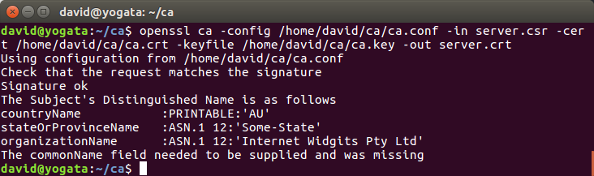

<p style="page-break-after:always;"></p>
# Network Security Lab 20
<p><!-- pagebreak --></p>
# Network Security Lab 20
David Ayeke
April 17. 2017

1. Generating CA certs:
```
openssl genrsa -out ca.key 2048
2074  openssl req -new -key ca.key                   -out ca.csr
2076  openssl x509 -req -days 10000               -in ca.csr                    -out ca.crt                   -signkey ca.key
```

2. Generating Server certs
```
openssl ca -config /home/david/ca/ca.conf -in server.csr -cert /home/david/ca/ca.crt -keyfile /home/david/ca/ca.key -out server.crt
 2085  openssl genrsa -out client.key 2048
 2086  openssl req -new -key client.key -out client.csr
 2087  openssl ca -config /home/david/ca/ca.conf -in client.csr -cert /home/david/ca/ca.crt -keyfile /home/david/ca/ca.key -out client.crt
```

3. Generating client certs with export

```
openssl genrsa -out client.key 2048
 2086  openssl req -new -key client.key -out client.csr
 2087  openssl ca -config /home/david/ca/ca.conf -in client.csr -cert /home/david/ca/ca.crt -keyfile /home/david/ca/ca.key -out client.crt
 2094  openssl pkcs12 -inkey client.key -in cclient.crt -export -out client.pfx
```

Output:


