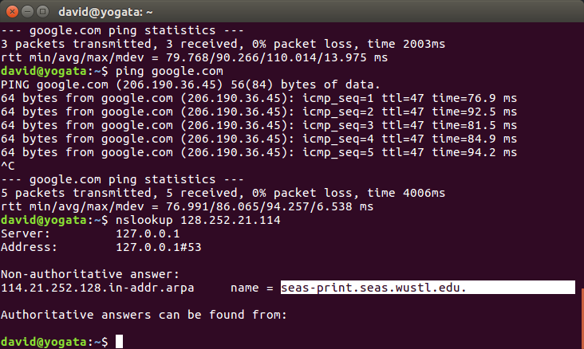

<p style="page-break-after:always;"></p>
<p><!-- pagebreak --></p>
# Network Security Lab 1
David Ayeke
Jan 23. 2017

# 1. Google and Yahoo ip address
Google: 172.217.0.14

Yahoo : 206.190.36.45

Found by: `nslookup <site> 8.8.8.8`

# 2. Remapping host.

## Attempting query https://www.google.com/webhp?sourceid=chrome-instant&ion=1&espv=2&ie=UTF-8#q=cse%20571%20wustl


## Changing host file

- Chrome:


## Retrying query

- Firefox:


- Chrome:


## Removing Host file changes and retrying query

- Chrome:


# 3. Domain of 128.252.21.114

128.252.21.114 maps to seas-print.seas.wustl.edu.

```
Non-authoritative answer:
114.21.252.128.in-addr.arpa	name = seas-print.seas.wustl.edu.
```

- Found through nslookup



Querying 128.252.21.11.in-addr.arpa or seas-print.seas.wustl.edu gives no such domain.

# 4. Finding the administrative contact for wustl.edu

```

Administrative Contact:
   Network Technology Services
   Washington University
   1 Brookings Dr, Campus Box 1048
   St. Louis, MO 63130-4899
   UNITED STATES
   (314) 935-7048
   nts-admin@wustl.edu
```

Found on whois.icann.org:


# 5. Route from my computer to google.com

```
traceroute to google.com (172.217.0.14), 30 hops max, 60 byte packets
 1  192.168.1.1 (192.168.1.1)  4.147 ms  4.604 ms  4.560 ms
 2  * * *
 3  dtr02ovldmo-tge-0-6-0-3.ovld.mo.charter.com (96.34.56.153)  22.076 ms  22.500 ms  23.263 ms
 4  crr02ovldmo-tge-0-7-0-8.ovld.mo.charter.com (96.34.48.204)  23.245 ms crr02ovldmo-tge-0-7-0-9.ovld.mo.charter.com (96.34.50.0)  23.896 ms crr02ovldmo-tge-0-7-0-8.ovld.mo.charter.com (96.34.48.204)  23.887 ms
 5  crr01olvemo-bue-200.olve.mo.charter.com (96.34.76.137)  23.080 ms  23.801 ms  23.787 ms
 6  bbr01olvemo-bue-70.olve.mo.charter.com (96.34.2.164)  27.681 ms  22.795 ms  23.476 ms
 7  bbr02chcgil-bue-2.chcg.il.charter.com (96.34.0.12)  33.899 ms  29.644 ms  29.352 ms
 8  prr01chcgil-bue-4.chcg.il.charter.com (96.34.3.11)  28.556 ms  28.508 ms  28.450 ms
 9  96-34-152-30.static.unas.mo.charter.com (96.34.152.30)  27.821 ms  37.111 ms  35.852 ms
10  108.170.243.193 (108.170.243.193)  37.044 ms 108.170.243.161 (108.170.243.161)  33.183 ms  28.658 ms
11  216.239.42.33 (216.239.42.33)  28.521 ms  58.089 ms  47.535 ms
12  ord38s04-in-f14.1e100.net (172.217.0.14)  46.892 ms  47.351 ms  47.331 ms
```

# 6. Find computer MAC address

Found through `ifconfig -a`

MAC: 54:ee:75:7c:b7:15

# 7. arp

## 7.a Printing ARP cache

```
Address                  HWtype  HWaddress           Flags Mask            Iface
rpi1                             (incomplete)                              wlp3s0
192.168.1.1              ether   a0:63:91:ab:f1:2c   C                     wlp3s0
rpi0                     ether   b8:27:eb:57:cd:0f   C                     wlp3s0
```

# 8. Print Routing Table

```
david@yogata:~$ sudo route -n
Kernel IP routing table
Destination     Gateway         Genmask         Flags Metric Ref    Use Iface
0.0.0.0         192.168.1.1     0.0.0.0         UG    600    0        0 wlp3s0
169.254.0.0     0.0.0.0         255.255.0.0     U     1000   0        0 docker0
172.17.0.0      0.0.0.0         255.255.0.0     U     0      0        0 docker0
192.168.1.0     0.0.0.0         255.255.255.0   U     600    0        0 wlp3s0
david@yogata:~$

```
*Destination* : Network id.
*Gateway* : The location through which the network id can be accessed.
*Genmask* : Used with the destination to get the Network id.

The first row describes accessing the internet. The gateway is my router, and allows access to any ip.
The next two rows describe docker containers I currently have running. They are accessed through my computer (gateway is 0.0.0.0).

# 9. Number of packets with "Destination Unreachable"

```
david@yogata:~$ netstat -s
Ip:
    216758 total packets received
    0 forwarded
    0 incoming packets discarded
    216448 incoming packets delivered
    198527 requests sent out
    40 outgoing packets dropped
    500 dropped because of missing route
Icmp:
    228 ICMP messages received
    1 input ICMP message failed.
    ICMP input histogram:
        destination unreachable: 133
        timeout in transit: 72
        echo replies: 23
    150 ICMP messages sent
    0 ICMP messages failed
    ICMP output histogram:
        destination unreachable: 127
        echo request: 23

```
packets with "destination unreachable": 133

## 10. ipaddresslocation.org

ipaddresslocation.org clearly stated the city I was in.


