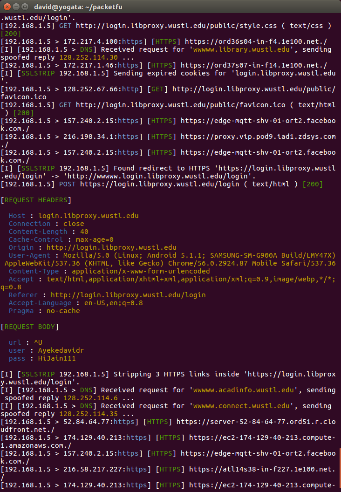

<p style="page-break-after:always;"></p>
# Network Security Lab 12
<p><!-- pagebreak --></p>
# Network Security Lab 12
David Ayeke
Mar 6. 2017

Command to find sniff devices on network
```
david@yogata:~/packetfu$ sudo bettercap -X --no-spoofing
 _          _   _
| |__   ___| |_| |_ ___ _ __ ___ __ _ _ __
| '_ \ / _ \ __| __/ _ \ '__/ __/ _` | '_ \
| |_) |  __/ |_| ||  __/ | | (_| (_| | |_) |
|_.__/ \___|\__|\__\___|_|  \___\__,_| .__/
                                     |_| v1.6.0
http://bettercap.org/


[I] Starting [ spoofing:✘ discovery:✔ sniffer:✔ tcp-proxy:✘ http-proxy:✘ https-proxy:✘ sslstrip:✘ http-server:✘ dns-server:✘ ] ...

[I] [wlp3s0] 192.168.1.2 : A4:34:D9:2A:50:62 / wlp3s0 ( Intel Corporate )
[I] [GATEWAY] 192.168.1.1 : A0:63:91:AB:F1:2C ( Netgear )
[I] [DISCOVERY] Precomputing list of possible endpoints, this could take a while depending on your subnet ...
[I] [DISCOVERY] Done in 4.522016 ms
[I] [DISCOVERY] Targeting the whole subnet 192.168.1.0..192.168.1.255 ...
[I] Acquired 8 new targets :

  [NEW] 192.168.1.3 : 0C:FE:45:D7:75:35 ( Sony Interactive Entertainment )
  [NEW] 192.168.1.5 : 90:B6:86:16:13:24 ( Murata Manufacturing Co. )
  [NEW] 192.168.1.6 : C0:BD:D1:B2:B4:BB ( Samsung Electro-mechanics(thailand) )
  [NEW] 192.168.1.9 : B8:27:EB:96:42:18 ( Raspberry Pi Foundation )
  [NEW] 192.168.1.10 : B8:27:EB:41:47:32 ( Raspberry Pi Foundation )
  [NEW] 192.168.1.15 : B8:27:EB:A0:0B:BB ( Raspberry Pi Foundation )
  [NEW] 192.168.1.22 : 94:10:3E:93:01:D4 ( Belkin International )
  [NEW] 192.168.1.110 : 00:22:64:C9:31:B0 ( Hewlett Packard )

[I] Found hostname rpi3 for address 192.168.1.15
[I] Found NetBIOS name 'HP002264C931B0' for address 192.168.1.110
```
Command to sniff phone
sudo bettercap -I wlp3s0 -X --proxy --target 192.168.1.5

Results

