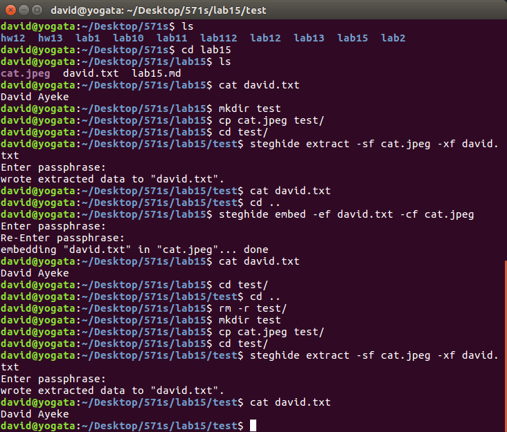

<p style="page-break-after:always;"></p>
# Network Security Lab 15
<p><!-- pagebreak --></p>
# Network Security Lab 15
David Ayeke
Mar 27. 2017

## 1. Created Text file and downloaded picture of cat.

### TextFile
```
david@yogata:~/Desktop/571s/lab15$ steghide embed -ef david.txt -cf cat.jpeg
Enter passphrase:
Re-Enter passphrase:
embedding "david.txt" in "cat.jpeg"... done
david@yogata:~/Desktop/571s/lab15$ cat david.txt
David Ayeke
david@yogata:~/Desktop/571s/lab15$

```

### Cat


## 2. Hide the text file.
```
david@yogata:~/Desktop/571s/lab15$ steghide embed -ef david.txt -cf cat.jpeg
```

## 3. Retrieved the text.
```
david@yogata:~/Desktop/571s/lab15$ mkdir test
david@yogata:~/Desktop/571s/lab15$ cp cat.jpeg test/
david@yogata:~/Desktop/571s/lab15$ cd test/
david@yogata:~/Desktop/571s/lab15/test$ steghide extract -sf cat.jpeg -xf david.txt
Enter passphrase:
wrote extracted data to "david.txt".
david@yogata:~/Desktop/571s/lab15/test$ cat david.txt
David Ayeke
david@yogata:~/Desktop/571s/lab15/test$
```

### Screenshot

