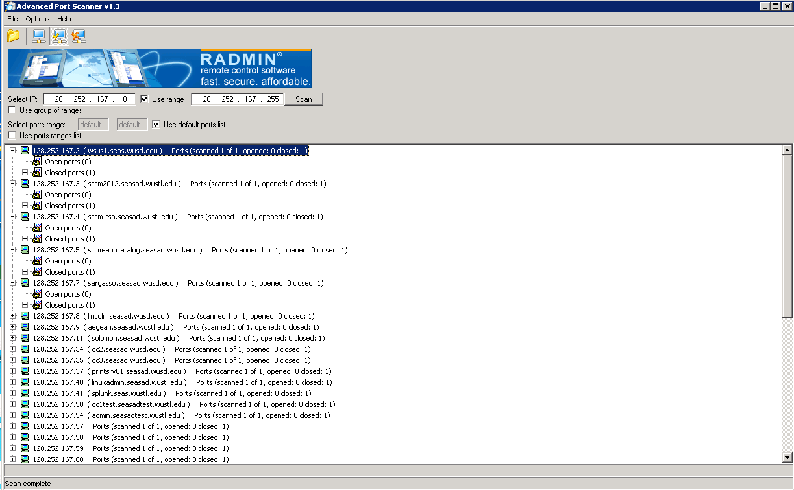
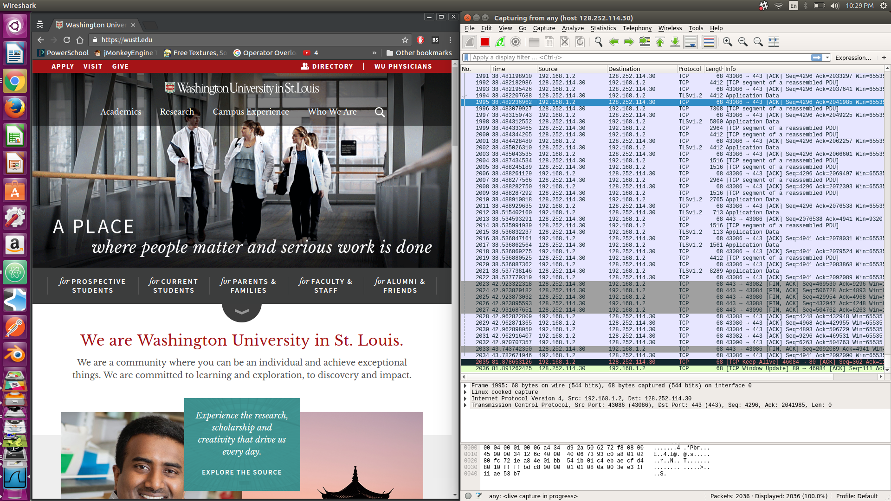

<p style="page-break-after:always;"></p>
# Network Security Lab 2
<p><!-- pagebreak --></p>
# Network Security Lab 2
David Ayeke
Jan 30. 2017

# 1. Scan of Advance Port Scanner



# 2. Use nmap to show the map of all host on your local net

```
david@yogata:~/Downloads$ sudo nmap -sP 192.168.1.*

Starting Nmap 7.01 ( https://nmap.org ) at 2017-01-29 22:23 CST
Nmap scan report for 192.168.1.1
Host is up (0.0063s latency).
MAC Address: A0:63:91:AB:F1:2C (Netgear)
Nmap scan report for 192.168.1.3
Host is up (0.0063s latency).
MAC Address: 0C:FE:45:D7:75:35 (Sony)
Nmap scan report for 192.168.1.6
Host is up (0.017s latency).
MAC Address: C0:BD:D1:B2:B4:BB (Samsung Electro Mechanics)
Nmap scan report for 192.168.1.9
Host is up (0.027s latency).
MAC Address: B8:27:EB:96:42:18 (Raspberry Pi Foundation)
Nmap scan report for 192.168.1.10
Host is up (0.027s latency).
MAC Address: B8:27:EB:41:47:32 (Raspberry Pi Foundation)
Nmap scan report for rpi0 (192.168.1.11)
Host is up (0.038s latency).
MAC Address: B8:27:EB:57:CD:0F (Raspberry Pi Foundation)
Nmap scan report for rpi3 (192.168.1.15)
Host is up (-0.067s latency).
MAC Address: B8:27:EB:A0:0B:BB (Raspberry Pi Foundation)
Nmap scan report for 192.168.1.18
Host is up (-0.085s latency).
MAC Address: 90:B6:86:16:13:24 (Murata Manufacturing)
Nmap scan report for 192.168.1.110
Host is up (-0.085s latency).
MAC Address: 00:22:64:C9:31:B0 (Hewlett Packard)
Nmap scan report for 192.168.1.2
Host is up.
Nmap done: 256 IP addresses (10 hosts up) scanned in 4.60 seconds
```
# 3. Capture all traffic from wireshark
First ping www.wustl.edu
```

david@yogata:~/Downloads$ ping www.wustl.edu
PING wordpress-prod.g.wustl.edu (128.252.114.30) 56(84) bytes of data.
64 bytes from wustl.edu (128.252.114.30): icmp_seq=1 ttl=242 time=15.0 ms
...
^C
--- wordpress-prod.g.wustl.edu ping statistics ---
18 packets transmitted, 18 received, 0% packet loss, time 17026ms
rtt min/avg/max/mdev = 13.157/14.561/23.761/2.427 ms
david@yogata:~/Downloads$
```


