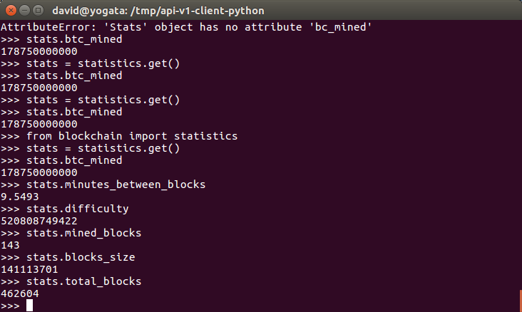
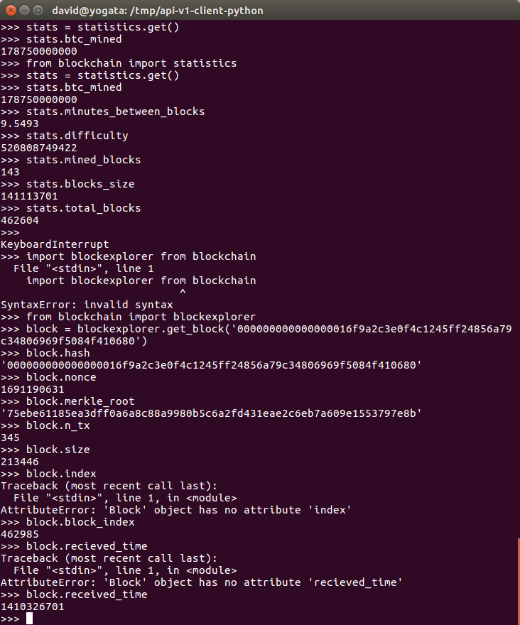
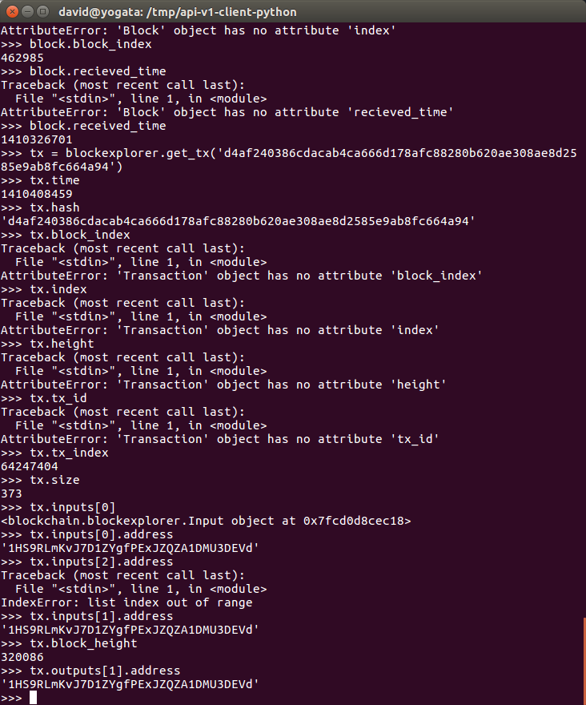

<p style="page-break-after:always;"></p>
# Network Security Lab 26
<p><!-- pagebreak --></p>
# Network Security Lab 26
David Ayeke
April 19. 2017

# Setup
```
>>> from blockchain import statistics
>>> stats = statistics.get()
>>>
```
1. How many bitcoins have been mined.
```
>>> stats.btc_mined
178750000000
>>>
```
2. Minutes betwen blocks
```
>>> stats.minutes_between_blocks
9.5493
```
3. Difficulty
```
>>> stats.difficulty
520808749422
```
4. Number of mined blocks
```
>>> stats.mined_blocks
143
```
5. Block Size
```
>>> stats.blocks_size
141113701
```
6. Total block numbers
```
>>> stats.total_blocks
462604
```


# Setup
```
>>> from blockchain import blockexplorer
>>> block = blockexplorer.get_block('000000000000000016f9a2c3e0f4c1245ff24856a79c34806969f5084f410680')
```
1. hash
```
>>> block.hash
'000000000000000016f9a2c3e0f4c1245ff24856a79c34806969f5084f410680'
```
2. nonce
```
>>> block.nonce
1691190631
```
3. merkle root
```
>>> block.merkle_root
'75ebe61185ea3dff0a6a8c88a9980b5c6a2fd431eae2c6eb7a609e1553797e8b'
```
4. transactions
```
>>> block.n_tx
345
```
5. Size
```
>>> block.size
213446
```
6. index
```
>>> block.block_index
462985
```
7. Received Time
```
>>> block.received_time
1410326701
>>>
```

# Setup
```
>>> tx = blockexplorer.get_tx('d4af240386cdacab4ca666d178afc88280b620ae308ae8d2585e9ab8fc664a94')
```
1. Time
```
>>> tx.time
1410408459
```
2. Hash
```
>>> tx.hash
'd4af240386cdacab4ca666d178afc88280b620ae308ae8d2585e9ab8fc664a94'
```
3. Block Index
```
>>> tx.block_height
320086
```
4. size
```
>>> tx.size
373
```
5. first input address
```
>>> tx.inputs[0]
<blockchain.blockexplorer.Input object at 0x7fcd0d8cec18>
>>> tx.inputs[0].address
'1HS9RLmKvJ7D1ZYgfPExJZQZA1DMU3DEVd'
```
6. second output address
```
>>> tx.outputs[1].address
'1HS9RLmKvJ7D1ZYgfPExJZQZA1DMU3DEVd'
```

